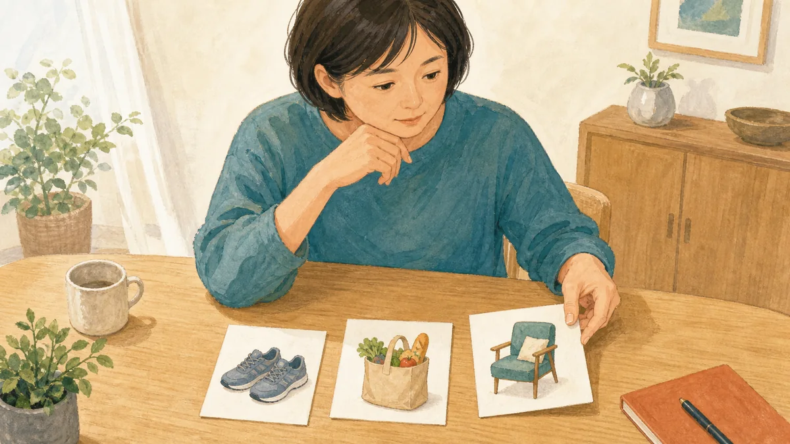

# 側弯症手術を後悔するのが怖い方へ｜決める前に確認したいこと

成人脊柱変形手術後77人の研究では中〜高い意思決定の後悔は7人でしたが、個人の確率ではありません。後悔への不安は、生活目標と変わらない可能性まで主治医と確認する材料にします。

&nbsp;

&nbsp;

&nbsp;

&nbsp;

&nbsp;

この記事の執筆・監修：奥村龍晃（柔道整復師） 
ーーーーーーーーーーーーーーーーーーーーーーーーーーーーーー

※一般情報としての構成と表現を確認したもので、医師による手術適応や術式の医学的監修を示すものではありません。

こんにちは！

姿勢や日常動作についてのご相談を受け付けているフィジカルバランスラボ整体院、 
院長の奥村龍晃です。

&nbsp;

<nav class="toc"><strong>目次</strong>
<ol>
  <li><a href="#はじめに">はじめに</a></li>
  <li><a href="#なぜ後悔への不安が起こるのか">なぜ後悔への不安が起こるのか</a></li>
  <li><a href="#解決の方向性">解決の方向性</a></li>
  <li><a href="#今日からできること">今日からできること</a></li>
  <li><a href="#まとめと次の一歩">まとめと次の一歩</a></li>
  <li><a href="#references">参考文献</a></li>
</ol>
</nav>

<h2 id="はじめに">はじめに</h2>

<strong>「側弯症の手術を受けて、あとで後悔しないでしょうか」</strong>

大きな手術を前にすると、受けると決めても、見送ると決めても、「別の選択のほうがよかったのでは」と不安になりますよね。痛み、歩きやすさ、見た目、仕事や家事、合併症など、気になることが一つではないからです。

「画像では手術を考える段階と言われたけれど、自分は何を基準に決めればいいのか分かりません」という相談を受けることがあります。これは施術後の変化ではなく、来院時によくある悩みとして紹介しています。

僕がまずお伝えしたいのは、後悔への不安があることと、手術が間違った選択であることは同じではないということです。不安を消そうと急いで結論を出すより、自分が変えたい生活と、手術でも変わらない可能性を主治医と確認する材料にしましょう。

<h2 id="なぜ後悔への不安が起こるのか">なぜ後悔への不安が起こるのか</h2>

意思決定の後悔とは、選んだ後に「別の選択のほうがよかったかもしれない」と感じることです。手術後の痛みや画像だけで決まるのではなく、期待していた生活とのずれ、回復にかかる時間、合併症、周囲の支えなどが重なります。長い旅行の行き先だけでなく、途中の道のりも納得感に影響するようなものです。

2024年の単施設の後ろ向き研究では、成人脊柱変形の手術を受けて回答した77人のうち、7人、約9%が中〜高い意思決定の後悔を報告しました。ただし、対象は40歳を超え、骨盤まで長く固定した方が中心です。単一の術者による研究で、回答しなかった人との違いもあるため、この9%をあなた個人の確率にはできません。

2023年の多施設研究では、術後2年以上の成人580人のうち、29人は同じ手術を受けない、79人は迷うと答え、合わせて18.6%でした。一方で472人は再び同じ手術を受けると答えています。研究に参加しなかった人も多く、複雑な成人手術を受けた集団の観察結果なので、手術全般の良し悪しを示す数字ではありません。

この研究で気になるのは、執刀医が「同じ手術を受けない」と答えた患者さんを正確に把握できた割合が13.8%だった点です。患者さんが感じる迷いは、画像や診察だけでは伝わりきらない可能性があります。だからこそ、何が怖いのか、何を変えたいのかを言葉にすることが大切です。

<h2 id="解決の方向性">解決の方向性</h2>

最初に分けたいのは、「どの瞬間が一番困るか」です。じっとしていても痛いのか、歩き始めなのか、長く歩いた後なのか、仕事や家事の途中なのか。手術で変えたい対象を「側弯症」だけにせず、生活の場面まで具体化すると、主治医へ質問しやすくなります。

2017年に11施設・248人を調べた観察研究では、術後の満足度は画像上の背骨の並びと強くは関連しませんでした。生活の質の一部とは弱〜中等度の関連でしたが、満足度を一つの指標だけで説明することはできません。観察研究なので原因は断定できませんが、画像の変化だけでなく「何ができるようになりたいか」を共有する必要性が見えてきます。

確認する順番は、現在の症状と困る場面を整理する → 手術で期待できることと限界を主治医に聞く → 回復期間や支援を含めて自分の優先順位と照らす、です。痛みが減る可能性だけでなく、変わらない可能性、合併症、再手術、固定後に難しくなる動き、仕事や家事へ戻る条件も同じ重さで尋ねてください。

2024年の70研究をまとめた系統的レビューでは、成人脊柱変形手術の前に、骨の状態、栄養、喫煙、糖尿病、慢性的な鎮痛薬の使用、心理面など、調整できる要因を確認する考え方が整理されています。ただし研究内容にはばらつきがあり、これらを整えれば後悔を防げると証明したものではありません。自分に関係する項目を手術施設で確認するための一覧として使えます。

安静時や夜間にも強い痛みがある、しびれや力の入りにくさが広がる、排尿・排便の変化、発熱や原因不明の体重減少、転倒後の悪化がある場合は、手術を迷う前に医療機関での確認を優先してください。急な脱力や排尿・排便の異常など緊急性が疑われる場合は、手術施設または救急へ速やかに相談します。

当院では、手術が必要か、どの術式が適切か、いつ手術するかを判断できません。これらは脊椎を専門とする医師へ確認してください。主治医の説明を受けたうえで、日常生活のどの場面に困り、何を質問したいかを整理する一般的な相談はお受けできます。

<h2 id="今日からできること">今日からできること</h2>

次の3つは、手術の可否を自己判断するためではなく、主治医との相談を具体的にする準備です。体を動かして確認する場合は、痛みが出たら中止してください。

<ol>
  <li><strong>困る瞬間と変えたいことを一枚に書く</strong> 安静時、歩き始め、長く歩いた後、仕事、家事、睡眠などから、自分が一番困る場面を書きます。その場面が手術でどの程度変わる可能性があるかを主治医へ確認します。</li>
  <li><strong>期待と限界を左右に並べる</strong> 期待できる変化だけでなく、変わらない可能性、合併症、再手術、固定後の動き、回復期間を同じ紙に並べます。数字は自分の年齢、固定範囲、持病に近い説明かも尋ねます。</li>
  <li><strong>次回受診の質問を声に出して確認する</strong> 「私の場合の目的は何ですか」「ほかの選択肢はありますか」「急がない場合に何を観察しますか」と質問を用意します。不安が強いときは、許可を得て家族に同席してもらう、説明を書き留める、別の専門医の意見を聞く方法も主治医へ相談してください。</li>
</ol>

<h2 id="まとめと次の一歩">まとめと次の一歩</h2>

側弯症手術の後悔を扱った研究では、同じ手術を再び選ぶ方が多い一方、後悔する方や迷う方もいました。ただし、研究は複雑な成人手術を受けた集団の観察結果で、あなたの将来を予測する数字ではありません。

<strong>大切なのは、後悔しないと保証されることではなく、自分が変えたい生活と受け入れにくいリスクを主治医と共有したうえで決めることです。</strong>

まずは困る瞬間を一つ書き出し、次の受診で「この場面は手術でどう変わる可能性がありますか」と尋ねてください。焦って不安を消すのではなく、納得して選ぶための情報を少しずつそろえていきましょう。

<h2 id="references">参考文献</h2>
<ul>
  <li>Decisional regret following corrective adult spinal deformity surgery: a single institution study of incidence and risk factors. Spine Deformity. 2024. 
      PMID: 38289505 / DOI: 10.1007/s43390-023-00790-y 
      <a href="https://pubmed.ncbi.nlm.nih.gov/38289505/">https://pubmed.ncbi.nlm.nih.gov/38289505/</a></li>
  <li>Would you do it again? Discrepancies between patient and surgeon perceptions following adult spine deformity surgery. The Spine Journal. 2023. 
      PMID: 37149153 / DOI: 10.1016/j.spinee.2023.04.018 
      <a href="https://pubmed.ncbi.nlm.nih.gov/37149153/">https://pubmed.ncbi.nlm.nih.gov/37149153/</a></li>
  <li>Patient Satisfaction After Adult Spinal Deformity Surgery Does Not Strongly Correlate With Health-Related Quality of Life Scores, Radiographic Parameters, or Occurrence of Complications. Spine. 2017. 
      PMID: 27748701 / DOI: 10.1097/BRS.0000000000001921 
      <a href="https://pubmed.ncbi.nlm.nih.gov/27748701/">https://pubmed.ncbi.nlm.nih.gov/27748701/</a></li>
  <li>Preoperative Optimization for Adult Spinal Deformity Surgery: A Systematic Review. Spine. 2024. 
      PMID: 37678375 / DOI: 10.1097/BRS.0000000000004823 
      <a href="https://pubmed.ncbi.nlm.nih.gov/37678375/">https://pubmed.ncbi.nlm.nih.gov/37678375/</a></li>
</ul>

<strong>※免責事項</strong> 
本記事の内容は一般的な情報提供を目的としており、個別の診断や治療を意図したものではありません。 
痛みや不調がある場合、運動中に痛みが出た場合は中止し、必要に応じて医療機関にご相談ください。 
症状が続く、強くなる、または日常生活に支障がある場合は、期間にかかわらず医療機関にご相談ください。

&nbsp;

公式LINEへのメッセージ送信は24時間可能です。返信は営業時間内です。 
ご予約や当院の一般的なご案内についてお問い合わせいただけます。診断・治療方針などの医療上の判断は医療機関へご相談ください。

&nbsp;

<a class="q_custom_button q_custom_button3" href="https://lin.ee/cZKMhZ6" target="_blank" rel="noopener">公式LINE</a>

&nbsp;

<footer>

ーーーーーーーーーーーーーーーーーーーーーーーーーーーー 
〒464-0026 
愛知県名古屋市千種区井上町117 井上協栄ビル2階 
名古屋市営地下鉄東山線「星ヶ丘駅」2番口徒歩2分 
愛知県名古屋市で、姿勢や日常動作についてのご相談を受け付ける整体院 
フィジカルバランスラボ整体院 
ーーーーーーーーーーーーーーーーーーーーーーーーーーーー

</footer>

