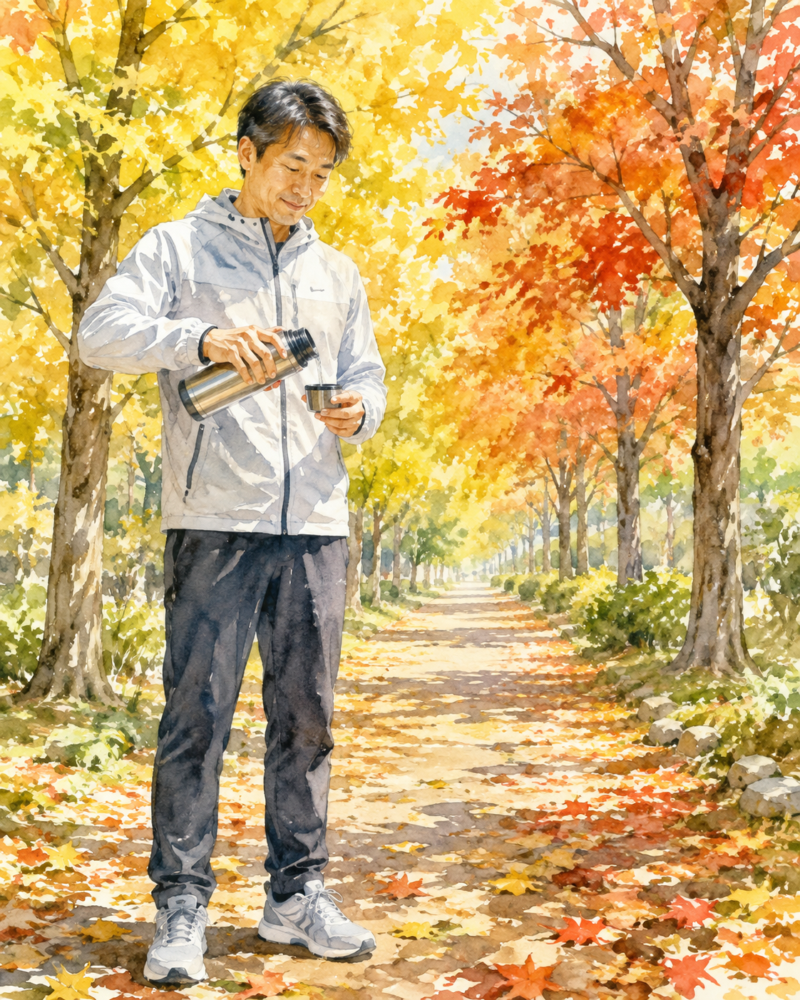
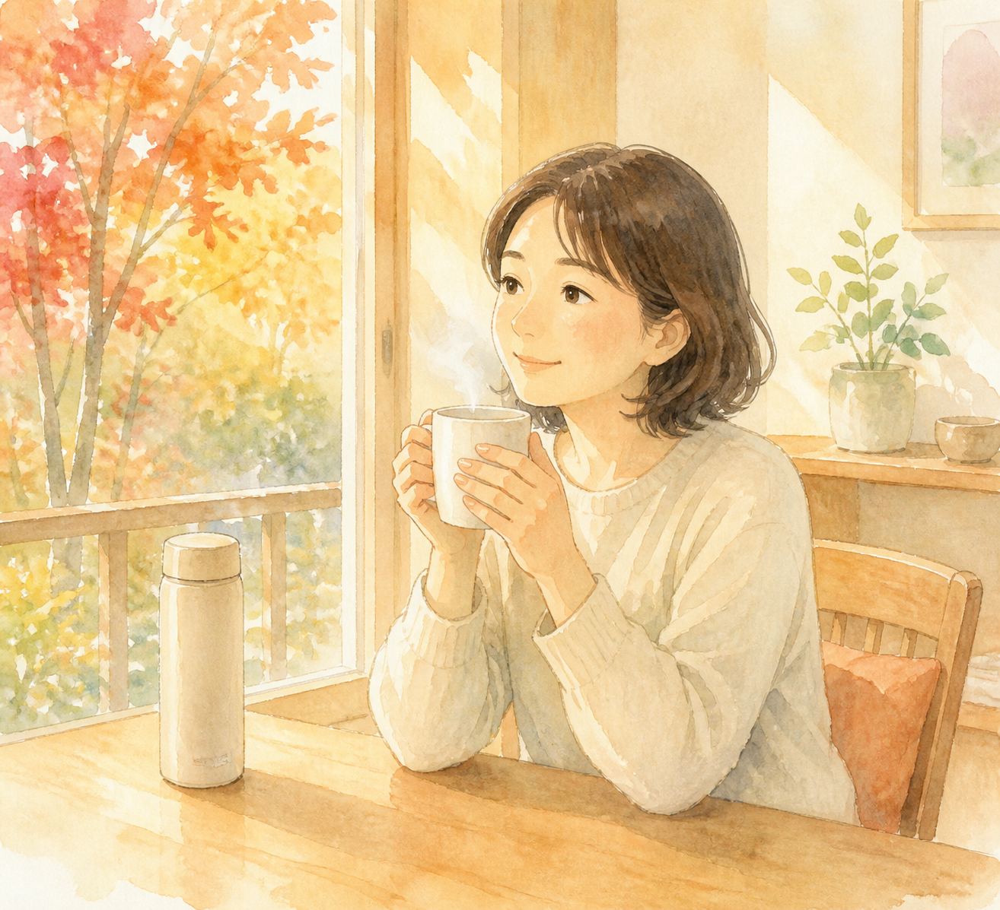

秋は喉の渇きを感じにくく、乾燥で知らぬ間に水分が失われる季節です。2%未満の軽い脱水でも気分や集中力への影響が研究で報告されています。秋の水分補給が大切な理由と、今日からできる3つの習慣を紹介します。

&nbsp;

&nbsp;

&nbsp;

&nbsp;

&nbsp;

この記事の執筆・監修：奥村龍晃（柔道整復師） 
ーーーーーーーーーーーーーーーーーーーーーーーーーーーーーー

こんにちは！

脊柱側弯症専門のフィジカルバランスラボ整体院、 
院長の奥村龍晃です。

&nbsp;

<nav class="toc"><strong>目次</strong>
<ol>
  <li><a href="#はじめに">はじめに</a></li>
  <li><a href="#なぜ秋は脱水に気づきにくいのか">なぜ秋は脱水に気づきにくいのか</a></li>
  <li><a href="#秋の体は水分不足でダメージを受けやすい">秋の体は水分不足でダメージを受けやすい</a></li>
  <li><a href="#水分不足を見分けて動き出す前に">水分不足を見分けて動き出す前に</a></li>
  <li><a href="#今日からできること">今日からできること</a></li>
  <li><a href="#まとめと次の一歩">まとめと次の一歩</a></li>
</ol>
</nav>

<h2 id="はじめに">はじめに</h2>

「涼しくなって運動を再開したんですけど、すぐ筋肉が張ってしまって。腰も重いし、なんだか疲れが取れないんです」——よくある相談例として、40代の方からこのような悩みを聞くことがあります。ここでは、施術後の変化や結果ではなく、来院時によくある悩みとして紹介しています。「涼しくなったから調子が上がるはずなのに、なぜだろう」というもどかしさも、聞こえてくる声です。

夏の暑さで運動を控えていて、秋になってから再開したものの、体の調子がなかなか上がらない。<strong>涼しくなって汗をかかなくなったせいか、1日に飲む水が麦茶1杯程度まで減っていた</strong>、という声もあります。

秋は、過ごしやすくて体にやさしい季節に見えます。ところが水分補給の面では、実はいちばん油断しやすい季節なんです。

今回は、なぜ秋に脱水が起きやすいのか、そして今日からできる対策を、僕が日々受ける相談をもとにお話ししていきます。

<h2 id="なぜ秋は脱水に気づきにくいのか">なぜ秋は脱水に気づきにくいのか</h2>

私たちの体の約60%は水分でできています。体重60kgの方なら、約36kgが水分です。この水分は、栄養を運び、老廃物を運び出し、体温を調える、いわば体の通り道そのものです。

研究では、体重の2%未満の水分が失われるだけでも、頭痛や集中力の低下、気分の落ち込みにつながることが報告されています。60kgの方なら、1.2kg程度の水分です。ただし、こうした研究は若い方を対象にしたものが中心で、影響の出方には個人差があります。

「喉が渇いたら飲めばいい」と思われがちですが、喉の渇きは、すでに体が水分不足になってから出るサイン。秋は、この渇きの感覚そのものが鈍りやすい季節なんです。

夏は暑さで、自然と飲み物に手が伸びます。ところが秋は涼しいんです。「汗もかいていないし、大丈夫」と思ってしまいがちです。

でも、汗をかかなくても、水分は失われています。皮膚や呼吸から、私たちは常に水分を出しています。これは不感蒸泄（汗として見えない形で出ていく水分）と呼ばれるものです。

特に秋は空気が乾燥するので、この見えない水分が、乾燥剤のそばに置いたスポンジのように、じわじわと体から奪われていきます。

もうひとつ、秋ならではの事情があります。朝晩と昼間の気温差です。体は、暑いときは汗で熱を逃がし、寒いときは血流を絞めて熱をためます。この自動調整には自律神経（体の自動調整機能）が働いていて、体温調節のために水分と血流が使われます。寒暖差の大きい秋は、この切り替えが何度も起こる季節。体の水分のやりくりも、思っている以上に忙しく動いているんです。

安静にしていても、1日に約2.5リットルの水分が失われます。食事からは約1リットル取れますが、残りの約1.5リットルは、意識して飲まなければなりません。

<h2 id="秋の体は水分不足でダメージを受けやすい">秋の体は水分不足でダメージを受けやすい</h2>

秋は「スポーツの秋」。紅葉を見に山へ、運動会の練習でグラウンドへ、久しぶりのゴルフへ。涼しくなって、ウォーキングやジョギング、山登りと、動き出す人が多くなる季節です。

でも、夏の間運動を控えていた体で急に動き出すと、リスクがあります。

筋肉は約75%が水分です。水分が足りない筋肉は、乾いたタオルのように硬く、しなやかさを失います。硬い筋肉はわずかな動きで傷つきやすく、ぎっくり腰や肉離れのもとになることがあります。

関節も同じです。関節は、関節液（関節の中の潤滑油のような液体）のおかげで滑らかに動きます。水分不足は、この潤滑油の材料まで減らしてしまいます。

夏に比べて動き始めの硬さを感じやすい秋は、筋肉と関節、両方のしなやかさを守る意味でも、水分が大切なんです。

さらに、夏バテで疲れた体の回復にも、水分は使われます。栄養を運ぶ血液も、老廃物を運び出すことも、水がなければできません。

秋は、夏の消耗を取り戻すためにも、しっかり水分を取りたい季節なんです。

秋は夏と違って、温かいお茶や白湯を取り入れやすい時期でもあります。飲み物を楽しみながら習慣にできるのは、この季節ならではの利点です。

<h2 id="水分不足を見分けて動き出す前に">水分不足を見分けて動き出す前に</h2>

自分の水分状態は、尿の色でチェックできます。薄いレモン色なら良好。濃い琥珀色なら、水分不足のサインです。

朝一番の尿が濃いのは普通ですが、日中ずっと濃い色が続くようなら、意識的に飲む量を増やしましょう。

肌もヒントをくれます。手の甲の皮膚を軽くつまんで離したとき、すぐに戻らないようなら、水分不足の可能性があります。乾燥しやすい季節の肌荒れも、外側のケアと一緒に、内側の水分を見直すきっかけになります。

朝晩の冷えでトイレが近くなり、夜の間に水分が失われやすいのも、この時期の特徴です。だからこそ、朝の1杯が効いてきます。

一方で、無理をしないサインもあります。立ちくらみや動悸が続く、尿の量が極端に減る、高熱がある、意識がぼんやりする。こうした状態が続くときは、水分補給だけで済ませず、医療機関への相談を優先してください。

運動をするときは、痛みゼロが原則です。張りや痛みが出たら、その日の運動は中止。無理をしないことが、長く体を動かし続けるコツです。

動き出す前に、整体で体の状態を確認することも、選択肢のひとつです。筋肉のこわばりや動きのくせは、自分では気づきにくいもの。だからこそ、動き出す前のチェックがあります。

<h2 id="今日からできること">今日からできること</h2>

1. 朝起きたら、コップ1杯の白湯を飲む。睡眠中は水分を失うため、朝は体が水分不足の状態です。白湯は体を冷やさず、胃腸にもやさしい飲み物です。秋の朝の冷えへの対策としても役立ちます。コップを洗って戻す位置に決めておくと、習慣になりやすいです。

2. 水筒を「目に入る場所」に置く。秋は渇きのサインが鈍るので、思い出す仕組みを作ることが大切です。デスクの上、リビングのテーブル。視界に入る場所に水を置いて、通りがかりに一口。白湯やぬるめのお茶は、冷えやすい体にもやさしい選択です。

3. 運動・レジャーの前後に、意識して1杯。運動の30分前にコップ1〜2杯、運動中は15分ごとに少量の水分が目安です。汗をたくさんかいたときは、塩分が入った飲み物も選択肢です。山登りやラウンドの日は「出発前に1杯」と決めておくと忘れにくいです。張りや痛みが出たら、その日は中止してください。

<h2 id="まとめと次の一歩">まとめと次の一歩</h2>

秋は涼しくて気持ちがいい反面、渇きを感じにくく、乾燥で体の水分が奪われやすい季節です。

研究では、2%未満の軽い脱水でも、気分や集中力への影響が報告されています。水分不足で筋肉が硬くなり、腰や肩の不調につながることもあります。

朝の白湯1杯。水筒を目につく場所に置く。運動の前後の1杯。<strong>小さな水分補給の積み重ねが、秋の体を守ります</strong>。

当院がいつも大切にしているのは、90歳でも自分の脚で歩ける体をつくること。その土台のひとつが、毎日の水分補給という、あたりまえの積み重ねなんです。

体の不調が気になるときは、無理せずご相談ください。当院では、姿勢や日常動作、体のケアについてのご相談を受け付けています。秋のスポーツやレジャーを思う存分楽しむためにも、まずは今日の1杯から始めてみてください。

<h2 id="参考文献">参考文献</h2>

<ul>
<li>Mild dehydration affects mood in healthy young women（Armstrong LE, et al. J Nutr. 2012） 
<a href="https://pubmed.ncbi.nlm.nih.gov/22190027/">https://pubmed.ncbi.nlm.nih.gov/22190027/</a></li>
<li>Mild dehydration impairs cognitive performance and mood of men（Ganio MS, et al. Br J Nutr. 2011） 
<a href="https://pubmed.ncbi.nlm.nih.gov/21736786/">https://pubmed.ncbi.nlm.nih.gov/21736786/</a></li>
<li>Water, hydration, and health（Popkin BM, et al. Nutr Rev. 2010） 
<a href="https://pubmed.ncbi.nlm.nih.gov/20646222/">https://pubmed.ncbi.nlm.nih.gov/20646222/</a></li>
</ul>

<strong>※免責事項</strong> 
本記事の内容は一般的な情報提供を目的としており、個別の診断や治療を意図したものではありません。 
痛みや不調がある場合、運動中に痛みが出た場合は中止し、必要に応じて医療機関にご相談ください。 
症状が続く、強くなる、または日常生活に支障がある場合は、期間にかかわらず医療機関にご相談ください。

&nbsp;

公式LINEへのメッセージ送信は24時間可能です。返信は営業時間内です。 
ご予約や当院の一般的なご案内についてお問い合わせいただけます。

&nbsp;

<a class="q_custom_button q_custom_button3" href="https://lin.ee/cZKMhZ6" target="_blank" rel="noopener">公式LINE</a>

&nbsp;

<footer>

ーーーーーーーーーーーーーーーーーーーーーーーーーーーー 
〒464-0026 
愛知県名古屋市千種区井上町117 井上協栄ビル2階 
名古屋市営地下鉄東山線「星ヶ丘駅」2番口徒歩2分 
愛知県名古屋市で、姿勢や日常動作についてのご相談を受け付ける整体院 
フィジカルバランスラボ整体院 
ーーーーーーーーーーーーーーーーーーーーーーーーーーーー

</footer>

## メタディスクリプション
秋は涼しくて喉の渇きを感じにくく、乾燥で水分が奪われやすい季節です。2%未満の軽い脱水でも気分や集中力への影響が研究で報告されています。秋の水分補給の理由と今日からできる3つの習慣を紹介します。

## サジェストキーワード
- 秋 水分補給
- 秋 脱水 症状
- 秋 疲れ 水分
- 水分補給 目安 量
- 秋 運動 筋肉 硬い
- 不感蒸泄 乾燥
- 白湯 朝 効果
