# 思春期特発性側弯症の真実：マーメイド図解版

## 50年間の研究が明かした意外な事実をビジュアルで解説

  
    アイオワ大学50年追跡研究の成果 <carbon:arrow-right class="inline"/>
  

---
transition: fade-out
---

# 研究の歴史的変遷

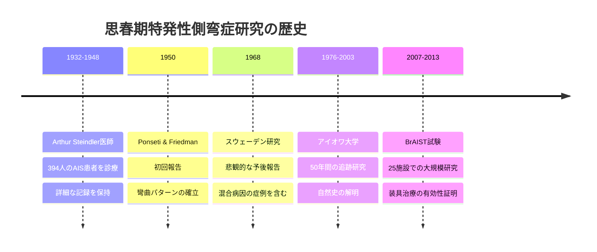

---

# 従来の誤解 vs 新たな発見

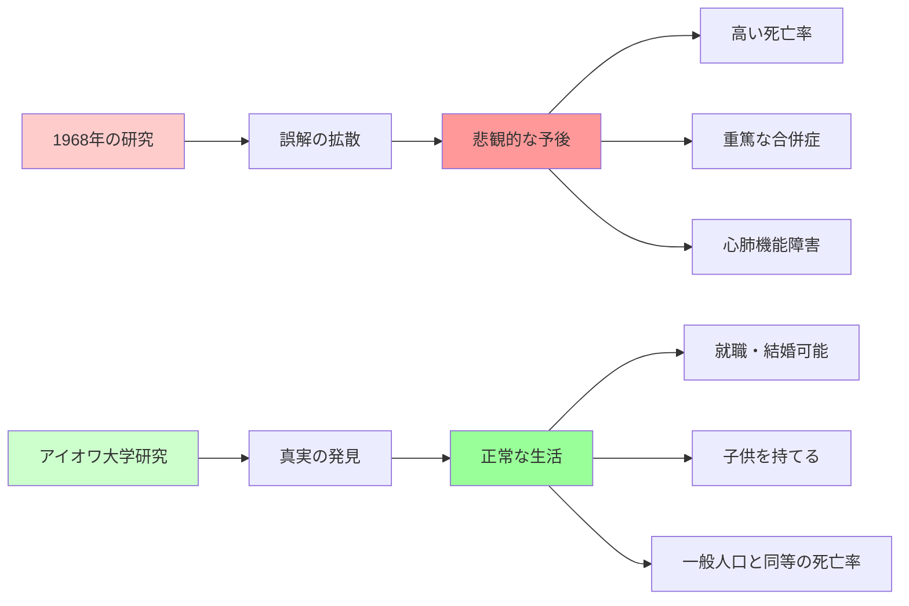

<v-click>

## 💡 重要なポイント

**従来の悲観的な見方は混合病因の症例を含む研究による誤解**

</v-click>

---

# 彎曲角度別リスク分析

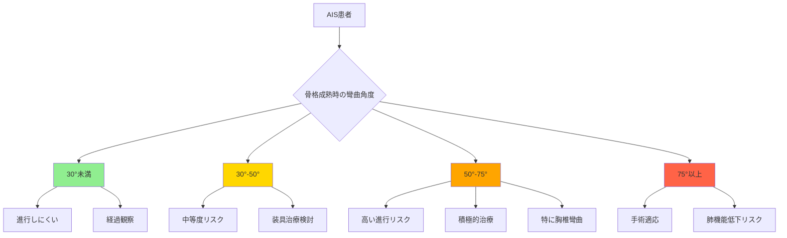

---

# 未治療AISの実際のリスク

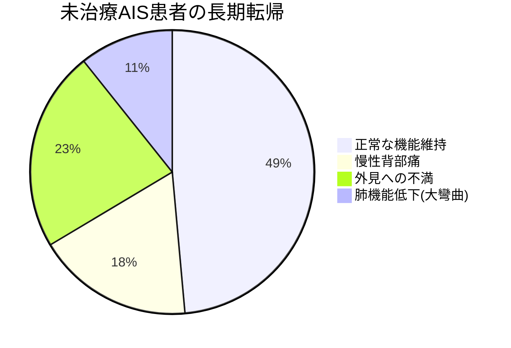

---

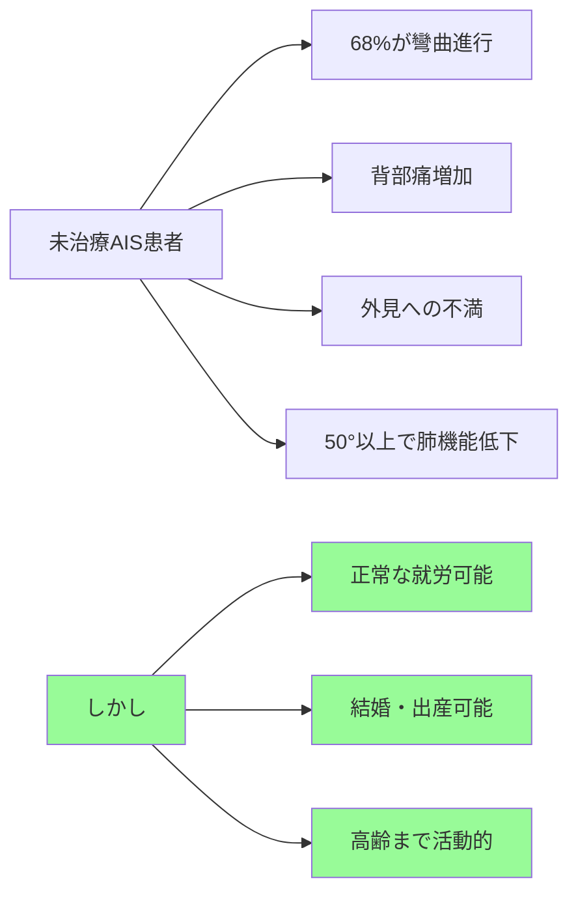

<v-click>

## 💡 重要な発見

**多くの患者は未治療でも正常な生活を送れる**

</v-click>

---

# BrAIST試験結果

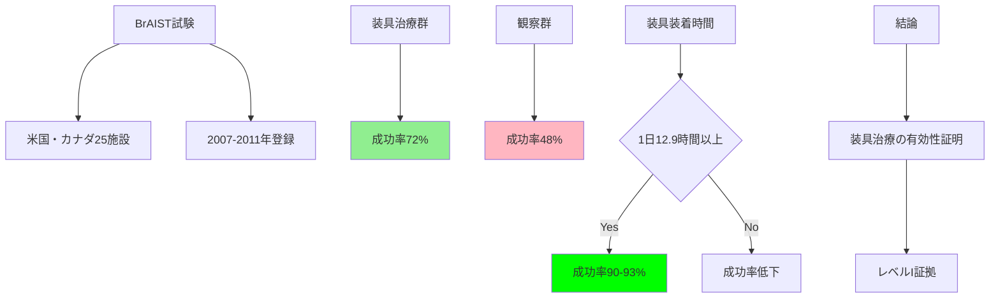

---

# 治療選択フローチャート

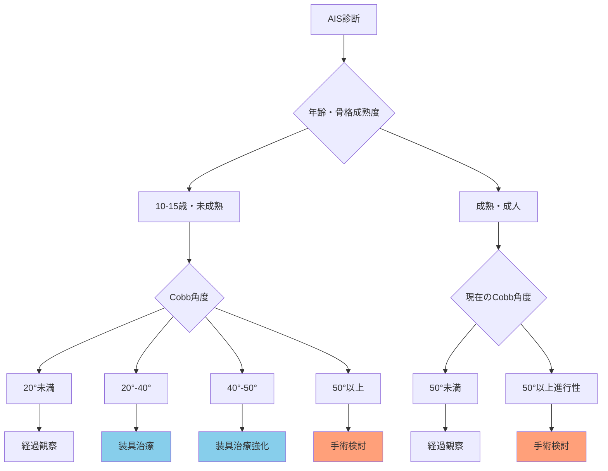

---

# 現代医療への影響

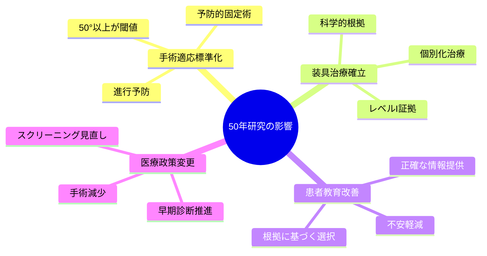

---

# 治療成績の比較

## 🔍 観察のみ
**成功率：48%**

- 自然経過を観察
- 定期的な検査
- 進行時に治療検討

## 🦴 装具治療
**成功率：72%**

- 日中装着
- 定期的な調整
- **12.9時間以上で90-93%**

## ⚕️ 手術治療
**50°以上で適応**

- 器械固定術
- 進行予防
- 変形矯正

<v-click>

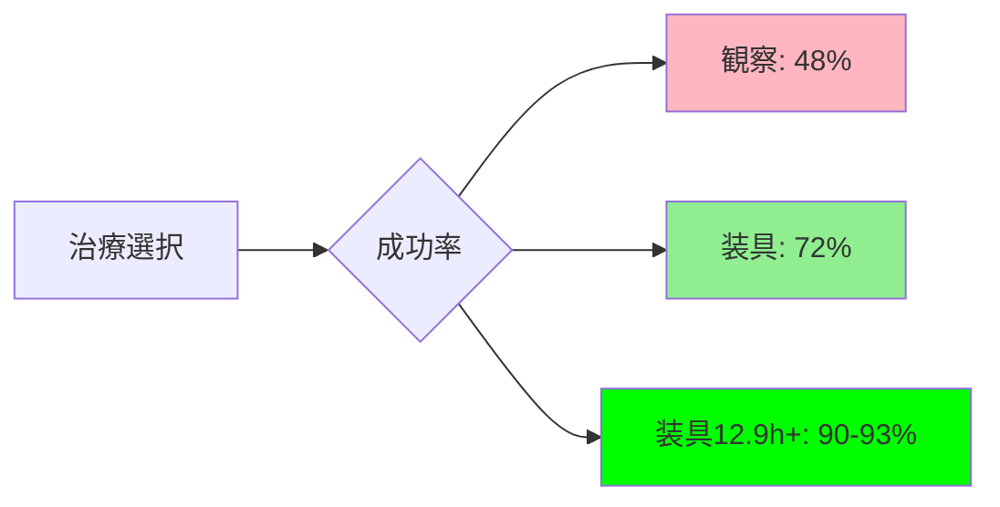

</v-click>

---
layout: center
class: text-center
---

# まとめ

<v-clicks>

## 🎯 重要なポイント

**従来の悲観的な見方は誤解**

**未治療でも多くが正常な生活を送れる**

**装具治療は科学的に有効**

**適切な情報に基づく治療選択が重要**

## 🏆 50年間の継続研究の意義

**根拠に基づく医療の重要性を示す素晴らしい例**

</v-clicks>

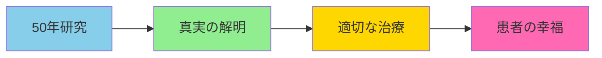

---
layout: center
class: text-center
---

# ありがとうございました

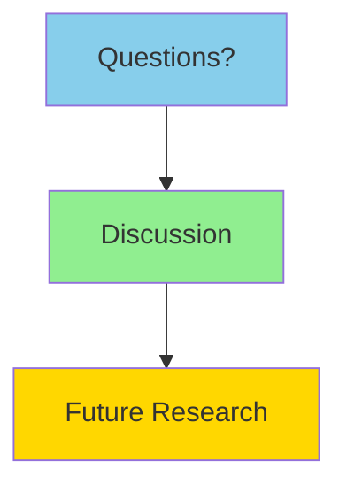

  
    ご質問をお待ちしております <carbon:arrow-right class="inline"/>
  

