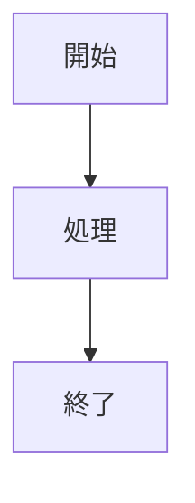

# Slidev + Mermaid トラブルシューティング完全ガイド

## 📅 作成日: 2025/6/10

## 🎯 本ドキュメントの目的
SlidevでMermaid図を表示しようとした際に発生した一連のエラーとその解決方法を詳細に記録し、同じ問題が二度と起きないようにするためのガイドです。

---

## 🚨 発生したエラーの一覧と根本原因

### 1. **最大の問題: VS Code Live Previewの誤使用**

#### エラー内容
```
GET http://localhost:3001/assets/index-CLuTtFdg.js net::ERR_ABORTED 401 (Unauthorized)
GET http://localhost:3001/assets/modules/shiki-Bxv373Z5.css net::ERR_ABORTED 401 (Unauthorized)
```

#### 根本原因
- **VS Code Live Preview（ポート3001）でSlidevを表示しようとした**
- Slidevは専用サーバー（ポート3030）で動作する必要がある
- VS Code Live Previewは単純なHTMLファイル用で、Slidevのような複雑なアプリケーションには不適切

#### 正しい方法
```bash
# ❌ 間違い: VS CodeでHTMLファイルを開く
# ✅ 正解: ブラウザで以下のURLを開く
http://localhost:3030/
```

### 2. **CORSエラー: ビルド済みファイルの直接開示**

#### エラー内容
```
Access to script at 'file:///assets/index-CLuTtFdg.js' from origin 'null' has been blocked by CORS policy
```

#### 根本原因
- `dist/index.html`をブラウザで直接開いた（file://プロトコル）
- モダンブラウザはセキュリティ上、file://からのJavaScriptモジュール読み込みを禁止

#### 解決方法
```bash
# ビルド済みファイルを正しく表示する方法
npx serve dist -p 8080
# ブラウザで http://localhost:8080/ を開く
```

### 3. **Mermaidモジュールの読み込みエラー**

#### エラー内容
```
TypeError: Failed to fetch dynamically imported module: http://localhost:3031/node_modules/mermaid/dist/flowDiagram-v2-74c8dbcc.js
```

#### 根本原因
- Slidev v0.48.9とMermaid v11.6.0の互換性問題
- Viteの設定とSlidevの内部設定の競合

#### 試みた解決策（失敗）
```javascript
// vite.config.js - これは逆効果でした
export default defineConfig({
  optimizeDeps: {
    include: ['mermaid']
  },
  resolve: {
    alias: {
      'mermaid': 'mermaid/dist/mermaid.esm.mjs'
    }
  }
})
```

### 4. **ポート番号の混乱**

#### 問題
- 複数のサーバーが異なるポートで起動（3030, 3031, 3001, 8080）
- どのURLが正しいか分からなくなった

#### 原因
- 複数のサーバーを同時に起動しようとした
- エラー解決のために異なるコマンドを試した結果

---

## ✅ 正しいSlidev + Mermaidの使用方法

### 1. **環境構築**

```bash
# 必要なパッケージのインストール
npm install @slidev/cli @slidev/theme-default mermaid
```

### 2. **Slidevスライドの作成**

```markdown
---
theme: default
highlighter: shiki
mermaid: true  # シンプルにtrueだけで十分
---

# タイトルスライド

---

# Mermaidダイアグラム


```

### 3. **正しい起動方法**

```bash
# 開発サーバーの起動
npx slidev スライドファイル名.md --open

# ポートを指定する場合
npx slidev スライドファイル名.md --port 3030 --open
```

### 4. **正しいアクセス方法**

- **必ずブラウザで開く**（Chrome, Firefox, Safari, Edge等）
- **URLは http://localhost:3030/**
- **VS Code Live Previewは使わない**

---

## 🛠️ トラブルシューティングチェックリスト

### Mermaid図が表示されない場合

1. **ブラウザの開発者ツールを確認**
   ```
   F12キー → Consoleタブ → エラーメッセージを確認
   ```

2. **Slidevのバージョンを確認**
   ```bash
   npx slidev --version
   ```

3. **キャッシュをクリア**
   - ブラウザ: Ctrl+F5 (Windows) / Cmd+Shift+R (Mac)
   - Node.js: `rm -rf node_modules && npm install`

4. **最小構成でテスト**
   ```markdown
   ---
   mermaid: true
   ---
   
   # Test
   
   ```mermaid
   graph TD
       A[Test]
   ```
   ```

### サーバーが起動しない場合

1. **既存プロセスを終了**
   ```bash
   # すべてのSlidevプロセスを終了
   pkill -f slidev
   
   # ポートが使用中か確認
   lsof -i :3030
   ```

2. **別のポートで起動**
   ```bash
   npx slidev slides.md --port 3333
   ```

---

## 📋 ベストプラクティス

### やるべきこと ✅

1. **常に `npm run dev` または `npx slidev` でサーバーを起動**
2. **ブラウザで http://localhost:ポート番号/ を開く**
3. **package.jsonにスクリプトを定義**
   ```json
   {
     "scripts": {
       "dev": "slidev slides.md",
       "build": "slidev build slides.md",
       "export": "slidev export slides.md"
     }
   }
   ```

4. **Mermaid設定はシンプルに**
   ```yaml
   ---
   mermaid: true
   ---
   ```

### やってはいけないこと ❌

1. **VS Code Live Previewで開く**
2. **distフォルダのHTMLを直接開く**
3. **複数のサーバーを同時に起動する**
4. **vite.config.jsで複雑な設定を追加する**

---

## 🔄 代替ソリューション

### Mermaidがどうしても動作しない場合

1. **Mermaid図をSVGに変換**
   ```bash
   # Mermaid CLIをインストール
   npm install -D @mermaid-js/mermaid-cli
   
   # 図をSVGに変換
   npx mmdc -i diagram.mmd -o diagram.svg
   ```

2. **オンラインツールを使用**
   - [Mermaid Live Editor](https://mermaid.live/)
   - SVGをダウンロードして画像として埋め込む

3. **Slidevのバージョンを最新に更新**
   ```bash
   npm update @slidev/cli
   ```

---

## 📝 まとめ

### 重要なポイント

1. **Slidevは専用サーバーが必要**
   - VS Code Live Previewは使えない
   - 必ずブラウザで正しいURLを開く

2. **エラーの連鎖を防ぐ**
   - 一つの方法で失敗したら、環境をクリーンにしてから次を試す
   - 複数のサーバーを同時に起動しない

3. **シンプルな設定を維持**
   - 複雑な設定は避ける
   - 公式ドキュメントの推奨設定を使用

### 最終確認コマンド

```bash
# 1. すべてのプロセスを停止
pkill -f slidev

# 2. キャッシュをクリア
rm -rf node_modules .slidev

# 3. 依存関係を再インストール
npm install

# 4. Slidevを起動
npx slidev 思春期特発性側弯症_mermaid_slidev.md --open

# 5. ブラウザで確認（自動的に開かれる）
```

---

## 📚 参考リンク

- [Slidev公式ドキュメント](https://sli.dev/)
- [Mermaid公式ドキュメント](https://mermaid.js.org/)
- [Vite公式ドキュメント](https://vitejs.dev/)

---

## 🆘 それでも解決しない場合

1. Slidevのバージョンを確認し、最新版にアップデート
2. Node.jsのバージョンを確認（16.0.0以上推奨）
3. プロジェクトを新規作成してシンプルな構成から始める
4. GitHubのIssueを確認して同様の問題がないか調べる

このドキュメントを参照することで、同じエラーを繰り返すことなく、スムーズにSlidevでMermaid図を含むプレゼンテーションを作成できるようになります。