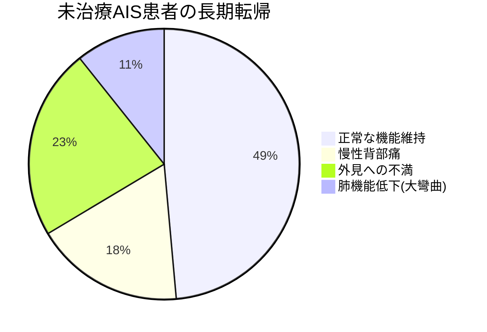

# Slidev エラーログと解決方法 - 追加分
## 📅 作成日: 2025/6/10

## 🚨 新たに発生したエラー

### 1. サーバーが突然停止する問題

#### 症状
- ファイル編集後、http://localhost:3030/ にアクセスできなくなった
- 「サイトにアクセスできません」エラーが表示される

#### 原因
- Slidevサーバーが何らかの理由で停止
- ターミナルウィンドウが閉じられた可能性
- プロセスが中断された

#### 診断結果
```bash
# ポート3030を確認
lsof -i :3030
# 結果: 何も表示されない（プロセスが存在しない）

# Slidevプロセスを確認  
ps aux | grep slidev
# 結果: プロセスが見つからない
```

#### 解決方法
```bash
# バックグラウンドで再起動
cd "/Users/ryukouokumura/マイドライブ（okumura@physical-balance-lab.net）/PBL関連/医療資料"
nohup npx slidev 思春期特発性側弯症_mermaid_slidev.md --port 3030 > slidev.log 2>&1 &
```

---

### 2. HTMLタグの閉じタグエラー

#### エラー内容
```
21:41:06 [vite] Internal server error: Invalid end tag.
Plugin: vite:vue
File: /@slidev/slides/6.md:5:1
3  |  <div class="mermaid-container mermaid-xsmall" style="height: 300px;">
4  |  <Mermaid code-lz="..." v-bind="{}" /></div>
5  |  </div>
   |   ^
```

```
21:41:06 [vite] Internal server error: Element is missing end tag.
Plugin: vite:vue  
File: /@slidev/slides/5.md:4:1
4  |  <div class="grid grid-cols-2 gap-4">
   |   ^
```

#### 原因
ファイル編集時に以下の問題が発生：
1. `<div>`タグの開始と終了が一致していない
2. Mermaidブロックの途中で`</div>`を閉じてしまった
3. HTMLタグの入れ子構造が壊れている

#### 問題のあるコード構造
```markdown
<div class="grid grid-cols-2 gap-4">

<div class="mermaid-container" style="height: 300px;">



</div>

---  <!-- ここで突然スライドが終わっている -->

<div class="mermaid-container mermaid-xsmall" style="height: 300px;">
<!-- 前のdivが閉じていないのに新しいスライドが始まっている -->
```

#### 正しい構造
```markdown
<div class="grid grid-cols-2 gap-4">

<div class="mermaid-container" style="height: 300px;">


</div>

<div class="mermaid-container mermaid-xsmall" style="height: 300px;">


</div>

</div>  <!-- grid-cols-2のdivを正しく閉じる -->
```

---

## 🛠️ エラーを防ぐための対策

### 1. サーバーの安定運用

#### 自動復旧スクリプトの作成済み
```bash
# start-slidev.sh を使用
./start-slidev.sh
```

このスクリプトは：
- サーバーが停止しても自動的に再起動
- エラーログを`slidev.log`に記録
- Ctrl+Cで手動停止するまで継続

### 2. HTMLタグの検証

#### VS Codeの拡張機能を活用
1. **Auto Close Tag** - タグを自動的に閉じる
2. **Bracket Pair Colorizer** - 対応する括弧を色分け
3. **HTML Hint** - HTML構文エラーを検出

#### Slidevでのベストプラクティス
```markdown
---
# スライド1
---

<!-- 1つのスライド内でHTMLタグを完結させる -->
<div class="container">
  <div class="content">
    ここにコンテンツ
  </div>
</div>

---
# スライド2
---

<!-- 複数のスライドにまたがるHTMLタグは避ける -->
```

### 3. ファイル編集時の注意点

1. **保存前に構文をチェック**
   - VS Codeの「問題」パネルでエラーを確認
   - 赤い波線がある箇所を修正

2. **段階的に編集**
   - 大きな変更は小さなステップに分割
   - 各ステップで保存してプレビューを確認

3. **バックアップを取る**
   ```bash
   # 編集前にバックアップ
   cp 思春期特発性側弯症_mermaid_slidev.md 思春期特発性側弯症_mermaid_slidev.md.backup
   ```

---

## 📋 トラブルシューティング手順

### エラーが発生した場合の対処フロー

1. **ブラウザでエラーを確認**
   - F12で開発者ツールを開く
   - Consoleタブでエラーメッセージを確認

2. **ログファイルを確認**
   ```bash
   tail -f slidev.log
   ```

3. **構文エラーの場合**
   - エラーメッセージに示された行番号を確認
   - HTMLタグの対応を確認
   - 必要に応じてバックアップから復元

4. **サーバーが停止した場合**
   ```bash
   # プロセスを確認
   ps aux | grep slidev
   
   # 再起動
   npm run dev:mermaid
   ```

---

## 🔍 今回のエラーから学んだこと

1. **HTMLタグは必ずスライド内で完結させる**
   - Slidevは各スライドを独立したVueコンポーネントとして処理
   - スライドをまたぐHTMLタグは構文エラーになる

2. **サーバープロセスの管理が重要**
   - ターミナルを閉じるとサーバーも停止する
   - バックグラウンド実行（nohup）または自動復旧スクリプトを使用

3. **エラーメッセージは的確**
   - "Invalid end tag" → 閉じタグが間違っている
   - "Element is missing end tag" → 閉じタグが不足
   - 行番号を確認すれば問題箇所がすぐ分かる

---

## 📝 推奨される開発フロー

1. **サーバーを自動復旧モードで起動**
   ```bash
   ./start-slidev.sh
   ```

2. **別ウィンドウでエディタを開く**
   - VS Codeで`思春期特発性側弯症_mermaid_slidev.md`を編集

3. **ブラウザでプレビュー**
   - http://localhost:3030/ を開いたままにする
   - 保存するたびに自動更新される

4. **エラーが出たら**
   - ブラウザのコンソールを確認
   - `slidev.log`を確認
   - 該当箇所を修正

この手順に従えば、安定してSlidevの開発を続けることができます。