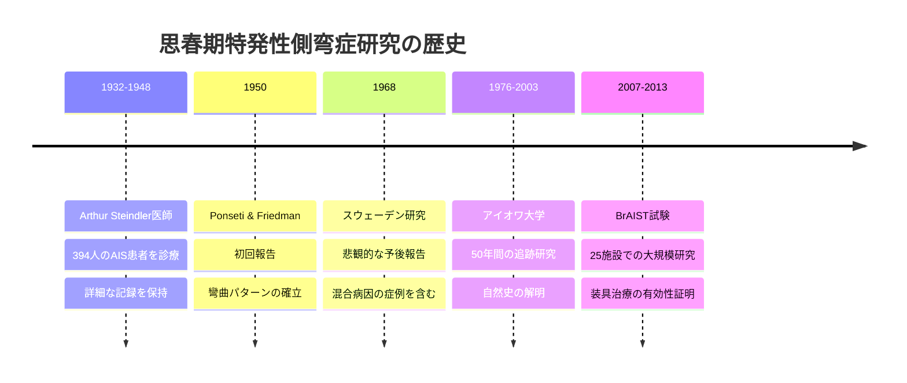
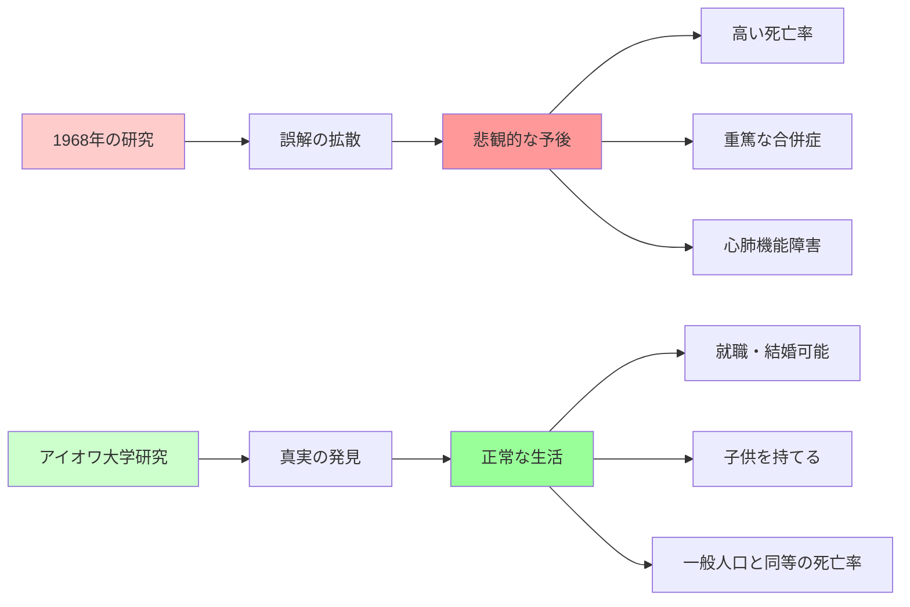
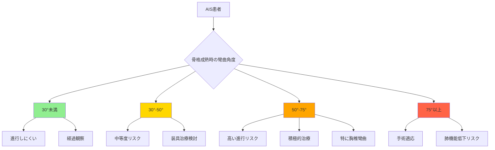
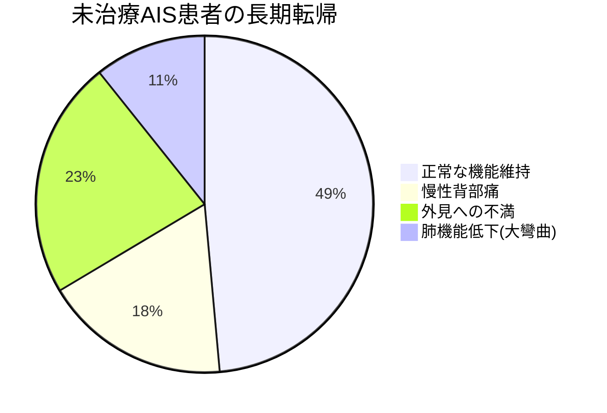
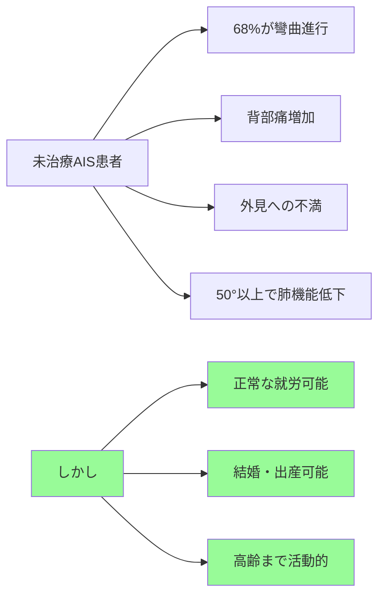
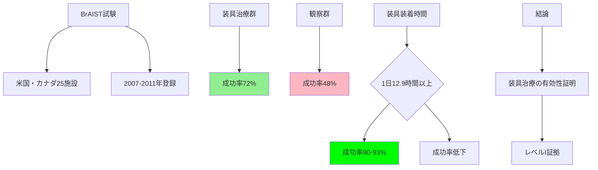
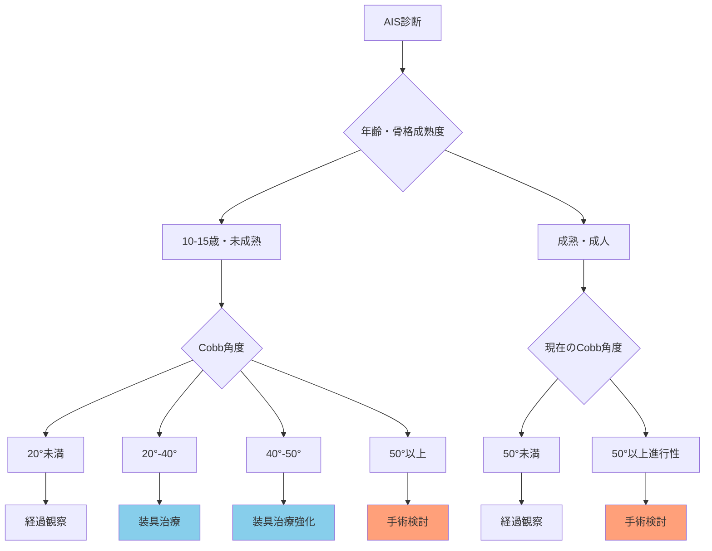
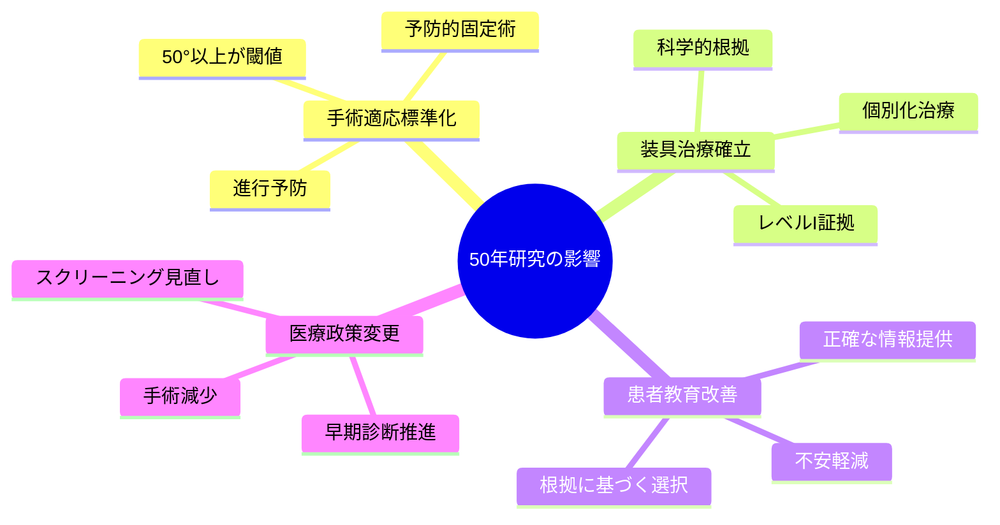

# 思春期特発性側弯症の真実：マーメイド図解版

## 1. 研究の歴史的変遷

## 2. 従来の誤解 vs 新たな発見

## 3. 彎曲角度別リスク分析

## 4. 未治療AISの実際のリスク

## 5. BrAIST試験結果

## 6. 治療選択フローチャート

## 7. 現代医療への影響

## まとめ

この図解により、思春期特発性側弯症の真実が視覚的に理解できます：

- **従来の悲観的な見方は誤解**
- **未治療でも多くが正常な生活を送れる**
- **装具治療は科学的に有効**
- **適切な情報に基づく治療選択が重要**

50年間の継続研究により、根拠に基づく医療の重要性が明確に示されました。